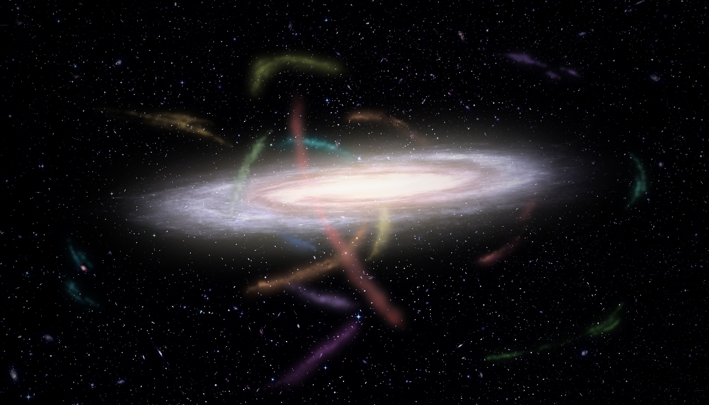
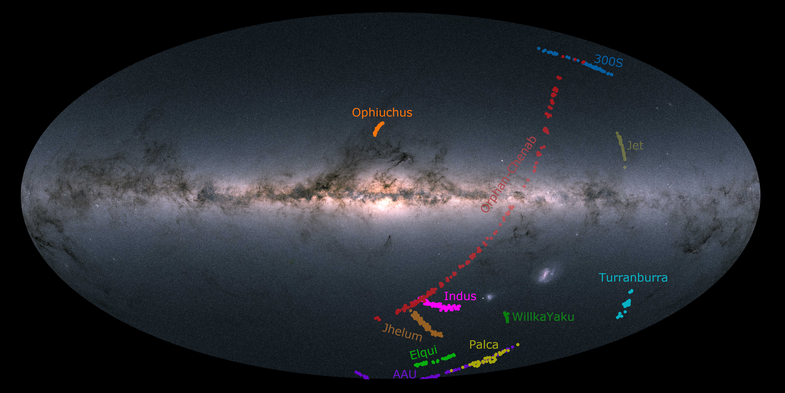
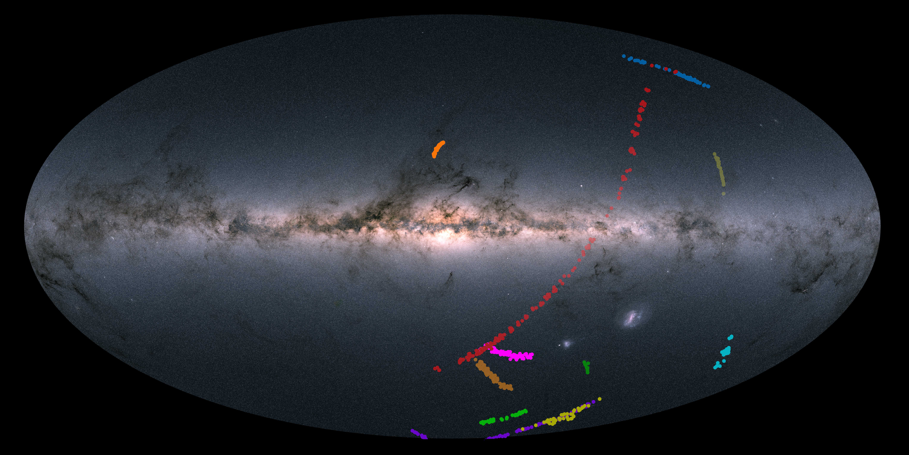
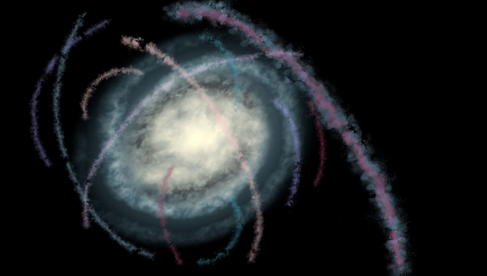
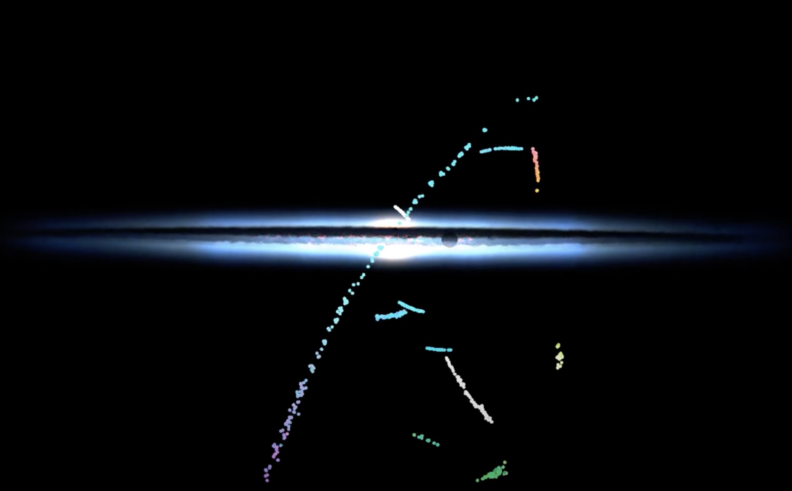

## The materials for the press-release on "Twelve for dinner: The Milky Way’s feeding habits shine a light on dark matter" 

The article "S5: The Orbital and Chemical Properties of One Dozen Stellar Streams" by Ting Li and collaborators was accepted inAmerican Astronomical Society’s Astrophysical Journal and is available [here](https://arxiv.org/abs/2110.06950). 

## Links: 
- [Homepage of Ting Li](https://sazabi4.github.io/)
- [The S5 collaboration](https://s5collab.github.io/)
- [The Anglo-Australian telescope](https://www.aao.gov.au/about-us/anglo-australian-telescope)
- [The Gaia satellite](https://sci.esa.int/web/gaia)

## Images:

All the images and videos are available in high resolution to download [here](images_videos/)

Caption: Artist representation of our Milky Way Galaxy surrounded by dozens of stellar streams. These streams were the companion satellite galaxies or globular clusters that are now being torn apart by our Galaxy’s gravity. (Credit: James Josephides and S5 Collaboration) [Download](images_videos/MilkyWayStreams.jpg)

---

Caption: Location of the stars in the dozen streams as seen on the sky. The background shows the stars in our Milky Way from the European Space Agency’s Gaia mission. The AAT is in a Southern Hemisphere telescope so only streams in the Southern sky are observed by S5.  (Credit: Ting Li, S5 Collaboration and European Space Agency) [Download w/ label](images_videos/all_streams_gaia_cap.jpg), [Download w/o label](images_videos/all_streams_gaia.jpg)

---

Caption: 
Artist impression of twelve stellar streams observed by S5, seeing from the Galactic South Pole.  (Credit: Geraint Lewis and S5 Collaboration) [Download](images_videos/dozenstream_southpole.png)

---
## Videos

Caption: A movie showing the 3-D location of individual stars in the dozen streams observed by S5. The colors of individual points are according to star’s 3-D velocity. (Credit: Sergey Koposov S5 Collaboration) [Download](images_videos/video_stream3D_220105.mp4)

